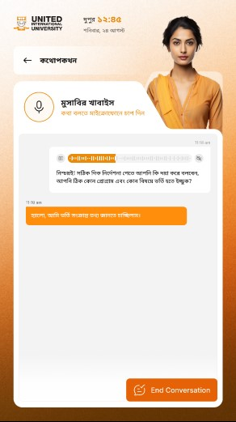

# Bangla TTS

This is my Text-to-Speech (TTS) project showcasing Bangla text and its audio output.
Its developed using vits2 model.

## TTS Model Outputs

| Bangla Text         | 
|---------------------|
| [আমি বাংলায় কথা বলি](https://raw.githubusercontent.com/ml-maddi/vits2_bangla/refs/heads/main/resources/bn1.mp3)|
| [তুমি কেমন আছো?](https://raw.githubusercontent.com/ml-maddi/vits2_bangla/main/resources/bn2.mp3) |
| [ভারত নিউজিল্যান্ড ফাইনালের ফল ঠিক করে দিতে পারে যে ৫ ‘ফ্যাক্টর’](https://raw.githubusercontent.com/ml-maddi/vits2_bangla/main/resources/bn3.mp3) |
| [মেয়েকে ফ্রিল্যান্সিং শেখাতে গিয়ে নিজেই সফল প্রযুক্তি পেশাজীবী হয়েছেন ফেরদৌস জাহান](https://raw.githubusercontent.com/ml-maddi/vits2_bangla/main/resources/bn4.mp3)|

## Main Project (Smart Ai Reception Assistant)

